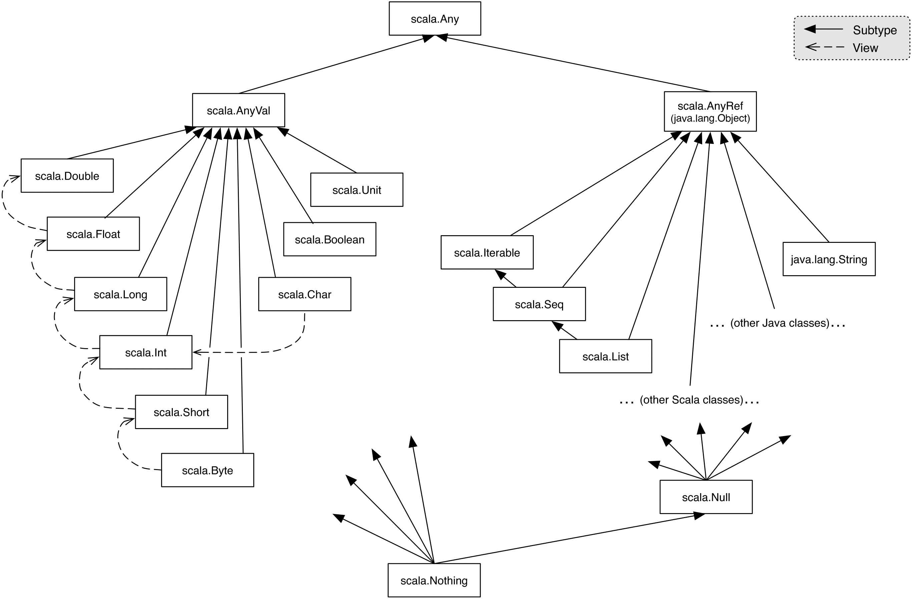

# Object oriented programming

### Abstract classes

Abstract classes can contain members which are missing an implementation,
these are called abstract members.

An abstract class must be preceded by the keyword `abstract`
```scala   
abstract class IntSet:
    def incl(x: Int): IntSet
    def contains(x: Int): Boolean
```

As an example, let's implement a `IntSet` using binary trees
```scala
class Empty() extends IntSet:
    def contains(x: Int): Boolean = false
    def incl(x: Int): IntSet = NonEmpty(x, Empty(), Empty())
```
We declare that `Empty()` extends `IntSet` by using the keyword `extends` 
followed by the abstract class' name.

```scala
class NonEmpty(elem: Int, left: IntSet, right: IntSet) extends IntSet:
    def contains(x: Int): Boolean = 
        if x < elem then left.contains(x)
        else if x > elem then right.contains(x)
        else true
    def incl(x: Int): IntSet = 
        if x < elem then NonEmpty(elem, left.incl(x), rigth)
        else if x > elem then NonEmpty(elem, left, right.incl(x))
        else this
```

For terminology, the base classes of a class `C` are its direct or indirect
superclasses. In our example, `IntSet` is a base class of `Empty`

Abstract classes can have implemented methods. These methods can be overridden
by its subclasses using the keyword `override`.

When we have a class which only has one implementation (like `Empty` in our 
previous example), we can make it a singleton with the `object` construction.
```scala   
object Empty extends IntSet:
    def contains(x: Int): Boolean = false
    def incl(x: Int): IntSet = NonEmpty(x, Empty(), Empty())
```
This makes sure that no more than one instance of `Empty` is present

There can be objects and classes with the same name as Scala has two
global namespaces:
 * one for types (classes go here)
 * one for values (objects go here)

When an object and a class are defined together in one same file, they are
said to be _companions_. This is a similar role to static classes in Java

Static methods would be implemented in the `object` definition, and general
ones in the `class` definition

### Programs
There are 2 ways to create a program in Scala
 1. Make an object with a `main` method, which takes an argument of type 
    `Array[String]` and has a return type of `Unit`
    ```scala
    object Hello:
        def main(args: Array[String]): Unit = println("Hello world!")
    ```
    This can be called using `> scala Hello`

 2. Annotate any function with `main` to be able to call it from the commandline
    ```scala
    @main def birthday(name: String, age: Int) = 
        println(s"Happy birthday, $name! $age years old already!")
    ```
    This can be called using `> scala birthday name age`

#### Exercise
##### Prompt
Write a method `union` for forming the union of two sets. You should implement 
the following abstract class:
```scala
abstract class IntSet:
    def incl(x: Int): IntSet
    def contains(x: Int): Boolean
    def union(other: IntSet): IntSet
```
##### Solution
```scala
object Empty extends IntSet:
    def incl(x: Int): IntSet = NonEmpty(x, Empty, Empty)
    def contains(x: Int): Boolean = false
    def union(other: IntSet): IntSet = other

class NonEmpty(elem: Int, right: IntSet, left: IntSet) extends IntSet:
    val root = elem
    def rhs = right
    def lhs = left
    def incl(x: Int): IntSet =
        if x < elem then NonEmpty(x, right, left.incl(x))
        else if x > elem then NonEmpty(x, right.incl(x), left)
        else this
    def contains(x: Int): Boolean =
        if x < elem then left.contains(x)
        else if x > elem then rigth.contains(x)
        else true
    def union(other: IntSet): IntSet =  // O(n) T(n) = 2T(n/2)
        if other == Empty then this
        else incl(other.root).union(other.right).union(other.left)
```

#### Dynamic binding
Object-oriented languages implement dynamic method dispatch

This means that the code invoked by a method call depends on the runtime
type of the object that contains the method. This is a natural consequence
from the system of reductions we introduced earlier.

This leads to an interesting question. Can we implement one concept in terms
of the other?
 * Objects in terms of higher-order functions
 * Higher-order functions in terms of objects

### How classes are organized
Classes and objects are organized in packages.

To place a class or object inside a package, use package clause at the top of
your source file.
```scala
package progfun.examples

object Hello:
```
To avoid using a fully qualified name, you can use the `import` clause
```scala
import week3.Rational           // imports just Rational
import week3.{Rational, Hello}  // imports both Rational and Hello
import week3._                  // imports everything in package week3
```

Some entities are automatically imported in any Scala program:
 * All members of package `scala`
 * All members of package `java.lang`
 * All members of the singleton object `scala.Predef`

| Object  | Qualified name       |
|---------|----------------------|
|`Int`    |`scala.Int`           |
|`Boolean`|`scala.Boolean`       |
|`Object` |`java.lang.Object`    |
|`require`|`scala.Predef.require`|
|`assert` |`scala.Predef.assert` |

#### `traits`
A `trait` is similar to an `interface` in Java, but more powerful in that it can
use have parameters and can contain fields and concrete methods. 

It's declared like an abstract class, but with `trait` instead of `abstract 
class`
```scala
trait Planer:
    def height: Int
    def width: Int
    def surface = height * width
```

#### Scala's class hierarchy


All classes extend `scala.Any`.  
 * Methods: `==`, `!=`, `equals`, `hashCode` and `toString`

The primitive types extend `scala.AnyVal`:
 * `scala.Double`
 * `scala.Float`
 * `scala.Long`
 * `scala.Int`
 * `scala.Short`
 * `scala.Byte`
 * `scala.Char`
 * `scala.Boolean`
 * `scala.Unit`

The reference types extend `scala.AnyRef`.

The `scala.Nothing` class extends all other classes. It has no value, instead 
it's used:
 * To signal abnormal termination
 * As an element type of empty collections

Scala's exception handling is similar to Java's. The expression `throw E` aborts
the evaluation with the exception `E`. The type of this expression is `Nothing`.

> #### Exercise
> ##### Prompt
> What is the type of
> ```scala
> if true then 1 else false
> ```
> ##### Solution
> ~~I believe it to be `Any`, because both objects and primitive values can be
> returned in an `if-then-else` expression. Although this expression in particular
> will return an `Int`, or `AnyVal` if the condition weren't know.~~
> 
> Actually, since `AnyVal` is the common base class of both `Int` and `Boolean`, 
> this is the type of the expression.

### Classes
### Cons-Lists
An immutable linked list is a fundamental data structure in many functional
languages. It is constructed from two building blocks:

`Nil`, the empty list  
`Cons`, a cell containing an element and the remainder of the list 

```scala
trait IntList ...
class Cons(val head: Int, val tail: IntList) extends IntList ...
object Nil extends IntList ...
```

Giving a preceding `val` to an argument in a class definition is a
shorthand way of making said argument a member as well.

#### Type parameters.
We can generalized the `*Int` out of the definition by using type parameters

Type parameters in a class are given inside square brackets `[]`
```scala
trait List[T]:
    def isEmpty: Boolean
    def head: T
    def tail: List[T]

class Cons[T](val head: T, val tail: List[T]) extends List[T]:
    def isEmpty = false

object Nil[T] extends List[T]:
    def isEmpty = true
    def head = throw new NoSuchElementException("Nil.head")
    def tail = throw new NoSuchElementException("Nil.tail")
```

Like classes, functions can have type parameters.

Type parameters can be left out if the compiler is able to infer the type of
the expression

#### Polymorphism
There are two types:
 * subtyping: instances of a subclass can be passed to a base class
 * generics: instances of a function or class are created by type 
   parametrization


> #### Exercise
> ##### Prompt
> Write a function `nth` that takes a list and an integer and selects the $n$-th
> element of the list.
> ```scala
> def nth[T](xs: List[T], n: Int): T = ???
> ```
> ##### Solution
> ```scala
> def nth[T](xs: List[T], n: Int): T =
>     if xs.isEmpty then
>         throw IndexOutOfBoundsException("The index is larger than the list's length")
>     else if n == 0 then
>         xs.head
>     else
>         nth(xs.tail, n-1)
> ```

### Objects everywhere
A pure object-oriented language is one in which every value is an object

In `Scala`, it seems like some types don't conform to this notion.

`Boolean` is mapped to the JVM's primitive type `boolean`. However, we could
define it as a class from first principles

> #### Exercise
> ##### Prompt
> Provide an implementation of an implication operator `==>` for class
> `idealized.scala.Boolean`
> ##### Solution
> ```scala
> package idealized.scala
> 
> class Boolean extends scala.AnyVal:
>     ...
>     def ==>(that: => Boolean): Boolean =
>     // a → b ←→ ¬a or b
>         !this || that
>     ...
> ```

`Int` is also mapped to a 32-bit integer, but it could also be implemented as a
class
```scala
class Int:
    def + (that: Double): Double
    def + (that: Float): Float
    def + (that: Long): Long
    def + (that: Int): Int // same for -, *, /, %

    def << (cnt: Int): Int // same for >>, >>>

    def & (that: Long): Long
    def & (that: Int): Int // same for |, ^ */

    def == (that: Double): Boolean
    def == (that: Float): Boolean
    def == (that: Long): Boolean // same for !=, <, >, <=, >=
    ...
```

#### Exercise
##### Prompt
Provide an implementation for the class `Nat`
```scala
abstract class Nat:
    def isZero: Boolean
    def predecessor: Nat
    def successor: Nat
    def + (that: Nat): Nat
    def - (that: Nat): Nat
```
##### Solution
```scala
abstract class Nat:
    def isZero: Boolean
    def predecessor: Nat
    def successor: Nat
    def + (that: Nat): Nat
    def - (that: Nat): Nat

object Zero extends Nat:
    def isZero: Boolean = true
    def predecessor: Nat = throw Exception("There is no natural lower than 0")
    def successor: Nat = Succ(Zero)
    def + (that: Nat): Nat = that
    def - (that: Nat): Nat = 
        if that.isZero then Zero else ???
    override def toString: String = "0"

class Succ(val predecessor: Nat) extends Nat:
    def isZero: Boolean = false
    def successor: Nat = Succ(this)
    def + (that: Nat): Nat = predecessor + Succ(that)
    def - (that: Nat): Nat = if that.isZero then this else predecessor - that.predecessor
    override def toString: String = s"s($predecessor)"
```

### Functions as objects

A function in Scala is also represented as an object. For example, `A => B` is
actually `scala.Function1[A, B]`.
```scala
package scala
trait Function1[A, B]:
    def apply(x: A): B
```

So functions are objects with `apply` methods.

Therefore, the anonymous function
```scala
(x: Int) => x * x
```
is expanded to:
```scala
new Function1[Int,Int]:
    def apply(x: Int) = x * x
```

This anonymous class itself can be thought of as a block that defines and
instantiates a local class
```scala
{   class $anonfun() extends Function1[Int, Int]:
        def apply(x: Int) = x * x
    $anonfun() }
```

An anonymous class can be created with the syntax

A function call `f(a,b)` is expanded to `f.apply(a,b)`.


#### Exercise
##### Prompt
In package `week3`, define an
```scala
object IntSet:
    ...
```
with 3 functions in it so that users can create `IntSets` of lengthss
0-2 using syntax
```scala
IntSet()
IntSet(1)
IntSet(2,3)
```
##### Solution
```scala
object IntSet:
    def apply = Empty
    def apply(a: Int): IntSet = Empty.incl(a)
    def apply(a: Int, a: Int): IntSet = Empty.incl(a).incl(b)
```
